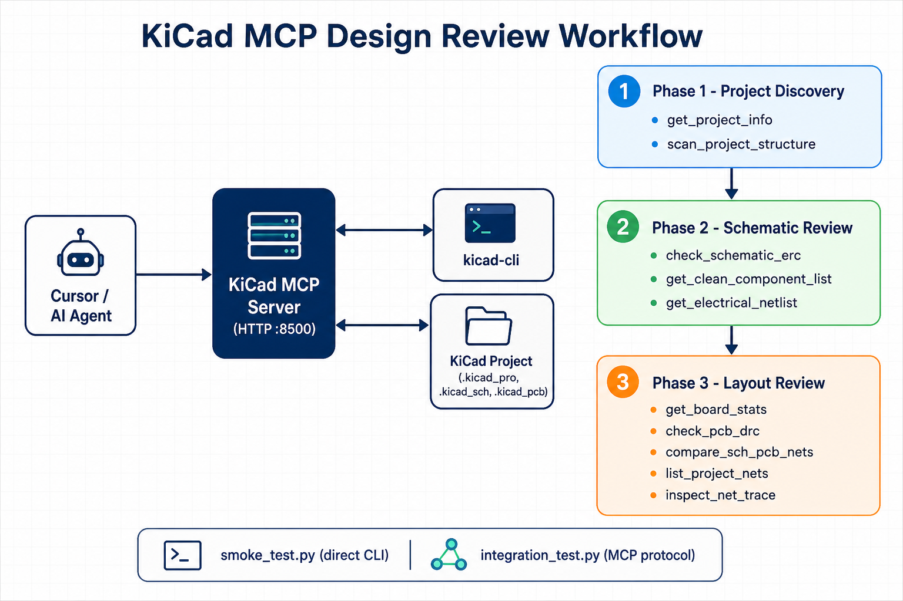

# kicad-mcp

MCP server for KiCad schematic and PCB layout design review.

**Version:** 0.3.0

## Overview

`kicad-mcp` exposes KiCad project data to AI agents through the [Model Context Protocol](https://modelcontextprotocol.io/) over HTTP. The server combines two data sources:

1. **`kicad-cli`** — ERC, DRC, BOM, netlist, board stats, and manufacturing exports (Gerber, drill, pick-and-place).
2. **Direct `.kicad_pcb` parsing** — footprint geometry, pad sizes, placement coordinates, copper zones, tracks, vias, and net routing analysis as structured JSON.

This lets agents review schematics, inspect land patterns (e.g. QFN exposed-pad dimensions), analyze copper pours, and validate fab outputs without opening KiCad manually.

## Workflow



Typical flow: project discovery → schematic review → layout/geometry review → manufacturing export check.

## Project layout

```
kicad-mcp/
  kicad_mcp/
    app.py                  # MCP server entry (FastMCP + HTTP)
    __main__.py             # python -m kicad_mcp
    config.py               # KiCad CLI path resolution
    project.py              # .kicad_pro / file discovery
    cli.py                  # kicad-cli subprocess helpers
    parsing.py              # netlist / PCB net-name helpers
    sexpr.py                # KiCad S-expression parser
    pcb_model.py            # footprint, geometry, zone, routing model
    prompts.py              # MCP review prompt templates
    review/
      schematic.py          # ERC, BOM, netlist
      layout.py             # DRC, board stats, net trace summary
      geometry.py           # footprint, placement, geometry, pours, routing
      manufacturing.py      # Gerber, drill, position, IPC-D-356 exports
      compare.py            # schematic vs PCB net comparison
    library/
      search.py             # MCP component search tools
      credentials.py        # distributor API key / token storage
      models.py             # normalized component records
      registry.py           # provider registry (Mouser, DigiKey, ...)
      providers/
        base.py             # provider interface
        mouser.py           # Mouser Search API client
        digikey.py          # DigiKey Product Information V4 (OAuth2)
      ecad/
        models.py           # ECAD part match / download models
        samacsys.py         # SamacSys Component Search Engine client
        ultralibrarian.py   # Ultra Librarian web export client
        registry.py         # ECAD provider registry
      ecad_tools.py         # SamacSys MCP download/search tools
  tests/
    test_pcb_model.py       # PCB parser unit tests
    smoke_test.py           # KiCad CLI smoke test (no MCP server)
    integration_test.py     # MCP server integration test
  img/
    kicad-mcp-workflow.png
  pyproject.toml
  README.md
```

## MCP tools

### Schematic tools

| Tool | Description |
|------|-------------|
| `get_project_info` | Resolve project files, net classes, and board defaults from `.kicad_pro` |
| `scan_project_structure` | List schematic sheets and PCB file |
| `get_clean_component_list` | Export BOM (reference, value, footprint) |
| `get_electrical_netlist` | Schematic connectivity netlist (S-expression) |
| `check_schematic_erc` | Run Electrical Rules Check (ERC) |

### Layout tools

| Tool | Description |
|------|-------------|
| `check_pcb_drc` | Run Design Rules Check (DRC) |
| `get_board_stats` | Board size, pad/via counts, copper area (via `kicad-cli`) |
| `list_project_nets` | All PCB nets grouped by power vs signal |
| `inspect_net_trace` | Human-readable net routing summary with IPC-2152 estimate |

### Geometry and footprint tools

These tools return **structured JSON** parsed from `.kicad_pcb`.

| Tool | Parameters | Description |
|------|------------|-------------|
| `get_component_footprint` | `project_dir`, `ref` | Pad size/shape/layer/net, courtyard, fab outline, silkscreen, absolute pad centers |
| `get_component_placement` | `project_dir` | Placement table: ref, value, footprint, side, X/Y, rotation, DNP, bounding box |
| `get_board_geometry` | `project_dir`, `layers?`, `include_graphics?` | Tracks, vias, copper zones, board graphics; optional layer filter e.g. `F.Cu,B.Cu` |
| `analyze_copper_pours` | `project_dir` | Zone fill state, layer, net, hatch, thermal settings, outline, filled islands |
| `analyze_net_routing` | `project_dir`, `net_name` | Segments, vias, zones, pads, connectivity islands, IPC-2152 estimate |

**Example — footprint review for a QFN MCU:**

```
get_component_footprint(
  project_dir: "D:/path/to/project",
  ref: "U4"
)
```

Returns pad dimensions, exposed-pad (EP) size, courtyard polygons, and absolute coordinates — useful for verifying land patterns against datasheet recommendations.

### Manufacturing tools

Export outputs default to `<project_dir>/mcp_exports/<category>/` unless `output_dir` is specified.

| Tool | Parameters | Description |
|------|------------|-------------|
| `export_gerbers` | `project_dir`, `output_dir?`, `layers?` | Generate Gerber fabrication files |
| `export_drill_files` | `project_dir`, `output_dir?`, `format?`, `units?` | Generate Excellon or Gerber drill files |
| `export_position_file` | `project_dir`, `output_dir?`, `format?`, `side?`, `units?`, `exclude_dnp?` | Pick-and-place / centroid file (CSV, ASCII, or Gerber) |
| `export_ipc_d356` | `project_dir`, `output_dir?` | IPC-D-356 netlist for electrical test |
| `inspect_manufacturing_exports` | `project_dir`, `output_dir?` | List files under gerbers, drill, position, and ipc_d356 folders |

Default export layout:

```
<project_dir>/mcp_exports/
  gerbers/
  drill/
  position/
  ipc_d356/
```

### Cross-domain tools

| Tool | Description |
|------|-------------|
| `compare_sch_pcb_nets` | Compare schematic vs PCB net names; flag sch-only or pcb-only nets |

### Component library tools

Search distributor catalogs for parts (Mouser and DigiKey).

| Tool | Description |
|------|-------------|
| `get_component_provider_status` | Show credential status for Mouser / DigiKey providers |
| `set_component_provider_credentials` | Set Mouser API key or DigiKey OAuth client credentials; optional persist to disk |
| `clear_component_provider_credentials` | Clear session or persisted credentials |
| `search_components_by_keyword` | Keyword search (Mouser or DigiKey) |
| `search_components_by_part_number` | Part-number / MPN search with optional manufacturer filter |

**Mouser setup**

1. Register a Search API key at [Mouser API Hub](https://api.mouser.com/api/docs/ui/index) (My Account → APIs).
2. Configure via environment variable or MCP tool:

```powershell
$env:MOUSER_API_KEY = "your-search-api-key"
```

Or at runtime:

```
set_component_provider_credentials(provider="mouser", api_key="...", persist=false)
```

Credentials can also be saved to `%APPDATA%\kicad-mcp\credentials.json` (Windows) or `~/.config/kicad-mcp/credentials.json` when `persist=true`.

**Example — keyword search**

```
search_components_by_keyword(
  keyword: "100nF 0402 X7R capacitor 25V",
  provider: "mouser",
  records: 10,
  search_options: "InStock"
)
```

**Example — part number lookup**

```
search_components_by_part_number(
  part_number: "STM32F407VGT6",
  provider: "mouser",
  match_mode: "Exact"
)
```

**DigiKey setup**

1. Create a Production or Sandbox application at [developer.digikey.com](https://developer.digikey.com/) and subscribe to **Product Information V4**.
2. Configure OAuth2 client credentials:

```powershell
$env:DIGIKEY_CLIENT_ID = "your-client-id"
$env:DIGIKEY_CLIENT_SECRET = "your-client-secret"
# Optional: use sandbox host while testing
$env:DIGIKEY_SANDBOX = "true"
```

Or at runtime:

```
set_component_provider_credentials(
  provider="digikey",
  client_id="your-client-id",
  client_secret="your-client-secret",
  persist=false
)
```

**Example — DigiKey part lookup**

```
search_components_by_part_number(
  part_number: "MIMX9352CVVXMAB",
  provider: "digikey",
  manufacturer: "NXP",
  match_mode: "Exact"
)
```

Returns normalized JSON records: MPN, distributor PN, manufacturer, description, stock, lead time, RoHS, price breaks, datasheet URL.

### ECAD library tools

Download KiCad symbols, footprints, and 3D models from ECAD providers using your free account credentials.

Supported providers:

- `samacsys` — [SamacSys Component Search Engine](https://componentsearchengine.com/)
- `ultralibrarian` — [Ultra Librarian](https://www.ultralibrarian.com/)

| Tool | Description |
|------|-------------|
| `get_ecad_provider_status` | Show SamacSys / Ultra Librarian credential status |
| `set_ecad_provider_credentials` | Set provider username/password; optional persist to disk |
| `clear_ecad_provider_credentials` | Clear session or persisted provider credentials |
| `search_ecad_components` | Search for exact MPN matches with downloadable KiCad libraries |
| `download_ecad_component_library` | Download and optionally extract KiCad library files |
| `debug_ultralibrarian_session` | Diagnose Ultra Librarian SSO connectivity and session cookies |

**SamacSys setup**

1. Register at [componentsearchengine.com/register](https://componentsearchengine.com/register).
2. Configure credentials:

```powershell
$env:SAMACSYS_USERNAME = "your@cse.account"
$env:SAMACSYS_PASSWORD = "your-password"
```

Or at runtime:

```
set_ecad_provider_credentials(
  provider="samacsys",
  username="your@cse.account",
  password="your-password",
  persist=false
)
```

**Example — search then download**

```
search_ecad_components(query="0201WMF220JTEE", manufacturer="Royalohm")
download_ecad_component_library(
  part_number="0201WMF220JTEE",
  manufacturer="Royalohm",
  output_dir="D:/Workspace/HW/libs/samacsys",
  extract=true
)
```

**Ultra Librarian setup**

1. Register at [ultralibrarian.com](https://www.ultralibrarian.com/).
2. Install Playwright and the Chromium browser (required for login + download):

```powershell
uv sync --extra playwright
uv run playwright install chromium
```

3. Configure credentials:

```powershell
$env:ULTRALIBRARIAN_USERNAME = "your@ul.account"
$env:ULTRALIBRARIAN_PASSWORD = "your-password"
# Downloads can take 60–120s; increase if MCP calls time out:
$env:KICAD_MCP_ULTRALIBRARIAN_PLAYWRIGHT_TIMEOUT = "300"
```

Or at runtime (optionally `persist=true` to save under `%APPDATA%\kicad-mcp\credentials.json`):

```
set_ecad_provider_credentials(
  provider="ultralibrarian",
  username="your@ul.account",
  password="your-password",
  persist=false
)
```

Ultra Librarian uses a **two-step Playwright flow** (matching the Ultra Librarian web UI):

1. **SSO login** from the home page (`#Email` / `#Password`), saving browser session state.
2. **Authenticated download** — search → part details → *Download Now* → expand KiCAD accordion → select **KiCad v6+** → set export options → click `a#submit-export`.

Ultra Librarian **search** uses anonymous HTTP. **Download and login** use headless Chromium via Playwright.

**Example — search then download**

```
search_ecad_components(
  query="STM32F479NIH6",
  manufacturer="STMicroelectronics",
  provider="ultralibrarian"
)
download_ecad_component_library(
  part_number="STM32F479NIH6",
  manufacturer="STMicroelectronics",
  provider="ultralibrarian",
  part_view_url="https://app.ultralibrarian.com/details/...",
  extract=true,
  overwrite=true
)
```

SamacSys downloads default to `%APPDATA%\\kicad-mcp\\samacsys-downloads`.
Ultra Librarian downloads default to `%APPDATA%\\kicad-mcp\\ultralibrarian-downloads`.
Ultra Librarian exports are **KiCad v6+ only**, preferring **Functional** symbol ordering (falls back to **Sequential** when needed) and **Metric (mm)** footprint units.

When `output_dir` is omitted, extracted layout is:

```
<output_dir>/<library_name>/
  <library_name>.kicad_sym
  <library_name>.pretty/*.kicad_mod
  <library_name>.3dshapes/*.{stp,wrl}
```

### MCP prompts

| Prompt | Description |
|--------|-------------|
| `schematic_review_checklist` | Guided schematic review workflow |
| `layout_review_checklist` | Guided layout, geometry, and manufacturing review |
| `full_design_review` | End-to-end schematic + layout + fab readiness review |

## Setup

Requires **Python 3.10+** and **KiCad 9 or 10** with `kicad-cli` on PATH (or set `KICAD_CLI`).

**Core server** (schematic/PCB review + SamacSys ECAD search/download):

```powershell
uv sync
uv run kicad-mcp
```

**Full server** (includes Ultra Librarian Playwright login/download):

```powershell
uv sync --extra playwright
uv run playwright install chromium
uv run --extra playwright kicad-mcp
```

Alternative entry point:

```powershell
uv run --extra playwright python -m kicad_mcp
```

Stop the server (Windows PowerShell):

```powershell
Stop-Process -Id (Get-NetTCPConnection -LocalPort 8500).OwningProcess -Force
```

Restart the MCP server after upgrading code or changing environment variables so tool handlers pick up the changes.

## Configuration

| Variable | Default | Purpose |
|----------|---------|---------|
| `KICAD_CLI` | auto-detected | Path to `kicad-cli` |
| `KICAD_MCP_HOST` | `127.0.0.1` | HTTP bind address |
| `KICAD_MCP_PORT` | `8500` | HTTP port |
| `MOUSER_API_KEY` | — | Mouser Search API key (alias: `MOUSER_SEARCH_API_KEY`) |
| `DIGIKEY_CLIENT_ID` | — | DigiKey OAuth2 client ID |
| `DIGIKEY_CLIENT_SECRET` | — | DigiKey OAuth2 client secret |
| `DIGIKEY_ACCESS_TOKEN` | — | Optional pre-issued DigiKey bearer token |
| `DIGIKEY_SANDBOX` | `false` | Use `sandbox-api.digikey.com` when `true` |
| `DIGIKEY_LOCALE_SITE` | `US` | DigiKey locale site header |
| `DIGIKEY_LOCALE_LANGUAGE` | `en` | DigiKey locale language header |
| `DIGIKEY_LOCALE_CURRENCY` | `USD` | DigiKey locale currency header |
| `SAMACSYS_USERNAME` | — | Component Search Engine login (alias: `SAMACSYS_CSE_USERNAME`) |
| `SAMACSYS_PASSWORD` | — | Component Search Engine password (alias: `SAMACSYS_CSE_PASSWORD`) |
| `ULTRALIBRARIAN_USERNAME` | — | Ultra Librarian login (alias: `UL_USERNAME`) |
| `ULTRALIBRARIAN_PASSWORD` | — | Ultra Librarian password (alias: `UL_PASSWORD`) |
| `KICAD_MCP_SAMACSYS_DOWNLOAD_DIR` | OS default | Override SamacSys download output directory |
| `KICAD_MCP_ULTRALIBRARIAN_DOWNLOAD_DIR` | OS default | Override Ultra Librarian download output directory |
| `KICAD_MCP_ULTRALIBRARIAN_PLAYWRIGHT_TIMEOUT` | `240` | Playwright step timeout in seconds (SSO + download) |
| `KICAD_MCP_ULTRALIBRARIAN_PLAYWRIGHT_HEADLESS` | `true` | Set `false` to show the browser window while debugging |
| `KICAD_MCP_CONFIG_DIR` | OS default | Override credential/config directory |

`kicad-cli` is auto-detected on Windows, macOS, and Linux. KiCad 10 name-only nets (e.g. `(net "GND")` on pads) are supported by the PCB parser.

## Cursor MCP config

Add to your Cursor MCP settings:

```json
{
  "mcpServers": {
    "kicad-hardware-agent": {
      "url": "http://localhost:8500/mcp"
    }
  }
}
```

Restart the MCP server after upgrading so new tools are registered.

## Suggested review workflow

1. **Discovery** — `get_project_info`, `scan_project_structure`
2. **Schematic** — `check_schematic_erc`, `get_clean_component_list`, `get_electrical_netlist`
3. **Layout checks** — `check_pcb_drc`, `get_board_stats`, `compare_sch_pcb_nets`, `list_project_nets`
4. **Geometry** — `get_component_footprint` (critical ICs), `get_component_placement`, `get_board_geometry`, `analyze_copper_pours`
5. **Nets** — `analyze_net_routing` or `inspect_net_trace` on power rails and critical interfaces (GND, VDD, USB, RF, SWD, SPI)
6. **Manufacturing** — `export_gerbers`, `export_drill_files`, `export_position_file`, `inspect_manufacturing_exports`

Or invoke the `full_design_review` MCP prompt for a guided checklist.

## Development

### Unit tests

```powershell
uv run python -m unittest discover -s tests -v
```

Ultra Librarian tests (mock Playwright; no browser required):

```powershell
uv run --extra playwright python -m unittest tests.test_ultralibrarian -v
```

### KiCad CLI smoke test (no MCP server)

```powershell
uv run python -u tests/smoke_test.py
```

### MCP integration test

Starts the server, exercises tools over MCP, then stops:

```powershell
uv run python -u tests/integration_test.py
```

With a specific project:

```powershell
uv run python -u tests/integration_test.py --project-dir "D:\path\to\project" --port 8500
```

## License

See repository license file if present.
